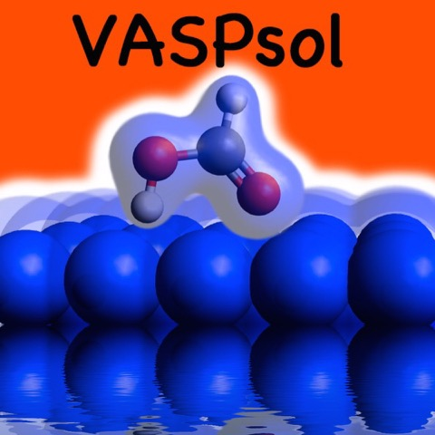

[](http://vaspsol.mse.ufl.edu/)

We have implemented an implicit solvation model that describes the effect of 
electrostatics, cavitation, and dispersion on the interaction between a solute 
and solvent into the plane-wave DFT code VASP. Our implementation provides a 
computationally efficient means to calculate the effects of solvation on molecules 
and crystal surfaces as well as reaction barriers. The strength of our solvation model 
implementation is its capability to handle large periodic systems such as metal and 
semiconductor surfaces and its interoperability with standard ultrasoft pseudopotential and 
projector-augmented wave potential libraries.

Prerequisites
===============
[VASP](http://www.vasp.at/) versions 5.2.12 or 5.3.3 or 5.3.5 or 5.4.1.

Compiler and library requirements are the same as that of VASP ([vasp wiki] (http://cms.mpi.univie.ac.at/wiki/index.php/Installing_VASP))

Installation
=============
**For VASP versions >= 5.4.1:**

These versions of VASP support solvation calculations out of the box.
The only thing that the user needs to do is to update the solvation routines by copying 
the **src/solvation.F** file to the src/ folder in the original VASP folder and 
follow the install instructions for the compilation of the original VASP.

**For VASP versions = 5.2.12 or 5.3.3 or 5.3.5:**

- Apply the appropriate interface patch to the original VASP source code. There are 3 interface_patch files 
available in the **patches** folder, one for each supported versions of VASP.
```   
    cd <VASP src directory>
    patch -p1 < <path to the interface patch file>
```
- After applying the patch, copy **src/solvation.F** file to the VASP source directory:
- In the original VASP Makefile, put solvation.o object file name before pot.o in that order.
- ``` make clean ```
- ``` make ```

Usage
======
Please see the file USAGE.md in the docs folder for instructions and the examples folder for some sample calculations.

References
===========
If you use the VASPsol package in your research, please cite the following paper:

Implicit solvation model for density-functional study of nanocrystal surfaces and reaction pathways.
 K. Mathew, R. Sundararaman, K. Letchworth-Weaver, T. A. Arias, and R. G. Hennig. J. Chem. Phys. 140, 084106 (2014), [doi:10.1063/1.4865107] (http://dx.doi.org/10.1063/1.4865107).

For discussions and feedback
=============================
Join our mailing list: https://groups.google.com/forum/#!forum/vaspsol

Contributing
=============
Please contact Dr. Richard Hennig (rhennig[at]mse.ufl.edu)

Authors
========
Kiran Mathew

Dr. Richard Hennig